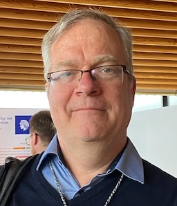

# Lifetime Achievement Award recipients

This page lists people who have received ACL SIGUR Lifetime Achievement Award.

## 2025: Jack Rueter

ACL SIGUR is proud to honour Dr. Jack Rueter with the Lifetime Achievement Award for his extraordinary contributions to the computational study and preservation of under-resourced and endangered languages. For more than three decades, Rueter has been a pioneering force in developing finite-state morphological descriptions, analyzers and linguistic resources for Uralic and other minority languages, including Komi-Zyrian, Erzya, Moksha and several Sámi languages. His work has provided essential digital infrastructure for languages that previously lacked computational representation.

Rueter’s career uniquely bridges traditional linguistic expertise and modern NLP innovation. He has advanced both rule-based and neural approaches to morphology, demonstrating how deeply crafted linguistic knowledge can strengthen and complement data-driven methods. His tools and corpora have empowered researchers, educators and language communities alike, supporting revitalization efforts and ensuring these languages have a place in the digital age.

Beyond his scholarly achievements, Rueter’s work is driven by a profound commitment to linguistic diversity and cultural stewardship. His collaborations with communities and researchers reflect a rare combination of technical insight, humility and human warmth.

[See Jack's research](https://www.researchgate.net/profile/Jack-Rueter)

